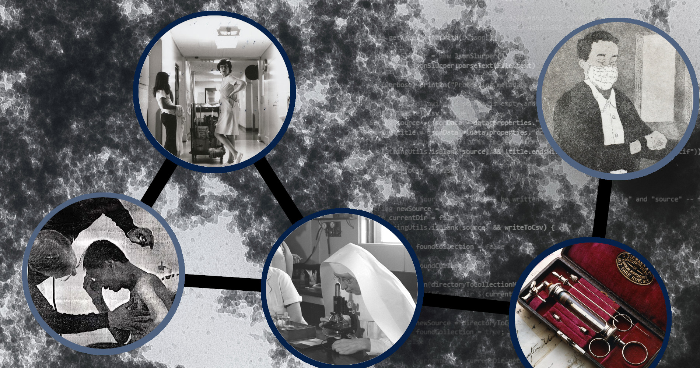

<h1>{{ site.title }}</h1>

    

{{ site.description }}

Read the <a href="{{ site.baseurl }}/white-paper">White Paper</a>




<!-- Pull Crash Course Lessons and Generate Cards -->
<h2>Digital Humanities Crash Course</h2>

    
        

            

                

                    <a href="{{ site.baseurl }}{{ lesson.permalink }}">
                        <h3 class="card-title">{{ lesson.title }}</h3>
                    </a>
                

                

                    
{{ lesson.abstract }}

                

            

        

    

<h2>Lessons</h2>

<!-- Pull non Crash Course lessongroups and generate cards -->
    
    
        
        

            

                

                    <a href="{{ site.baseurl }}{{ sectionloop.permalink }}">
                        <h3 class="card-title">{{ sectionloop.title }}</h3>
                    </a>
                

                

                    
{{ sectionloop.description }}

                

            

        

        
    

